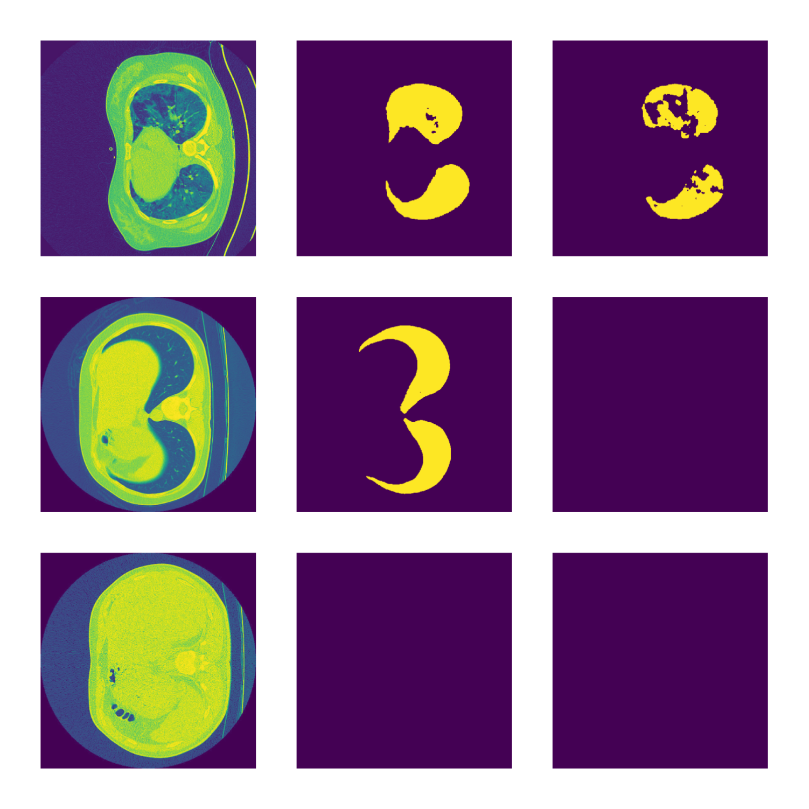
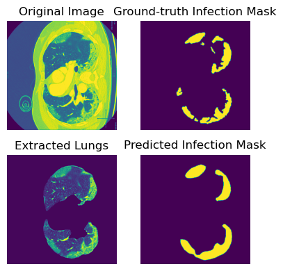

# Segmentation of COVID-infected Regions from CT Images

## Project Environment

This repository is tested on Ubuntu 22 with an Nvidia RTX 4090 GPU. To use this repository, please follow these steps:

- Make sure [anaconda](https://www.anaconda.com/docs/getting-started/anaconda/install) is installed.
- Clone this repository or download as a zip.
- Make sure your system has Anaconda installed. Open a terminal to the root directory and enter the following command:
`conda env create -f environment.yml`
This will create a conda environment with all the required libraries except `mmcv`.
- After the required libraries have been installed, type `conda activate medical_image_segmentation` in your terminal to activate the newly created environment.
- To install `mmcv`, type `conda install mmcv-full` in your terminal after activating the environment.
- To train, validate, and see the resulting outputs, open the [Jupyter Notebook](notebook.ipynb), select the installed conda environment as the kernel, and simply run all.

## Dataset

The dataset used for this work is the [COVID-19 CT Segmentation Dataset](http://medicalsegmentation.com/covid19/). To download and organize the dataset, run `bash download.sh` in your terminal from the project root directory. This command also downloads and organizes the pretrained model weights required for proper training of some of the models.

### Dataset Distribution

The dataset contains 2 separate databases.

#### [MedSeg Covid Dataset 1](https://figshare.com/articles/dataset/MedSeg_Covid_Dataset_1/13521488)

This contains 100 axial CT images with masks for lungs regions and infected regions. There are 3 classes of infection: 1: ground glass, 2: consolidation, 3: pleural effusion. For this work, we lumped all the infected regions into a single region, and converted the non-infected regions to the background. The images have been resize to $512 \times 512$ by the authors.

#### [Radiopaedia COVID-19 Dataset](https://radiopaedia.org/articles/covid-19-4?lang=us)

This contains 829 CT images, out of which 373 were labeled. This set also contains masks for lung regions and infected regions, and the infected regions are simlarly lumped as before. Since more than half of the images are not labeled, in other words, has no infected regions, using the unlabeled images would introduce noise into the model, which would affect the learning. This is why we decided to remove the unlabeled images, and use only the 373 labeled images. A previous step in the Project Environment section takes care of this pre-processing step. These images were not resized to $512 \times 512$ by the authors. 

### Data Split

We use the Radiopaedia COVID-19 Dataset for training and MedSeg Covid Dataset 1 for validation. This keeps a good balance of the training-validation ratio, and also allows us to analyze cross-database performance of the learned models. A few samples of the datasets are shown below:

  

The first column show the original CT image, the second column shows the corresponding lung masks, and the third column shows the corresponding infection masks. The first row is a good-quality CT image that captured the entire lung region, therefore the lungs mask is strong. The infection mask suggests the lungs are almost entirely infected. The second row image also detects the lungs regions nicely, but there appears to be no infection. The image in the third row was not able to detect the lungs, and, therefore, could not detection infection.

## Model Structure

We train a 2-stage model end-to-end. The first stage segments the lung-regions using the lung masks. The lungs regions are extracted from the original images using the learned lung masks to feed stage 2. The reasoning behind this is that the infection exists only within the lungs. If we can accurately segment out the lungs from the CT image, we can suppress unnecessary information while extracting the infected regions.

The second stage uses the extracted lung regions to locate the infected regions. The models used in the 2 stages of segmentation are identical.

### Architectures Used

We experimented with 3 different architectures.

- [ESFPNet](https://arxiv.org/abs/2207.07759).
- [PSPNet](https://arxiv.org/abs/1612.01105).
- [UNet](https://arxiv.org/abs/1505.04597).

If required, other architectures can be incorporated into the pipeline with little effort.

## Results

The following results were obtained with the PSPNet. The models do tend to struggle with infection regions that are scattered all over the lungs. However, the model works well with contiguous infected regions. Lung regions are nicely extracted more often than not.

  

